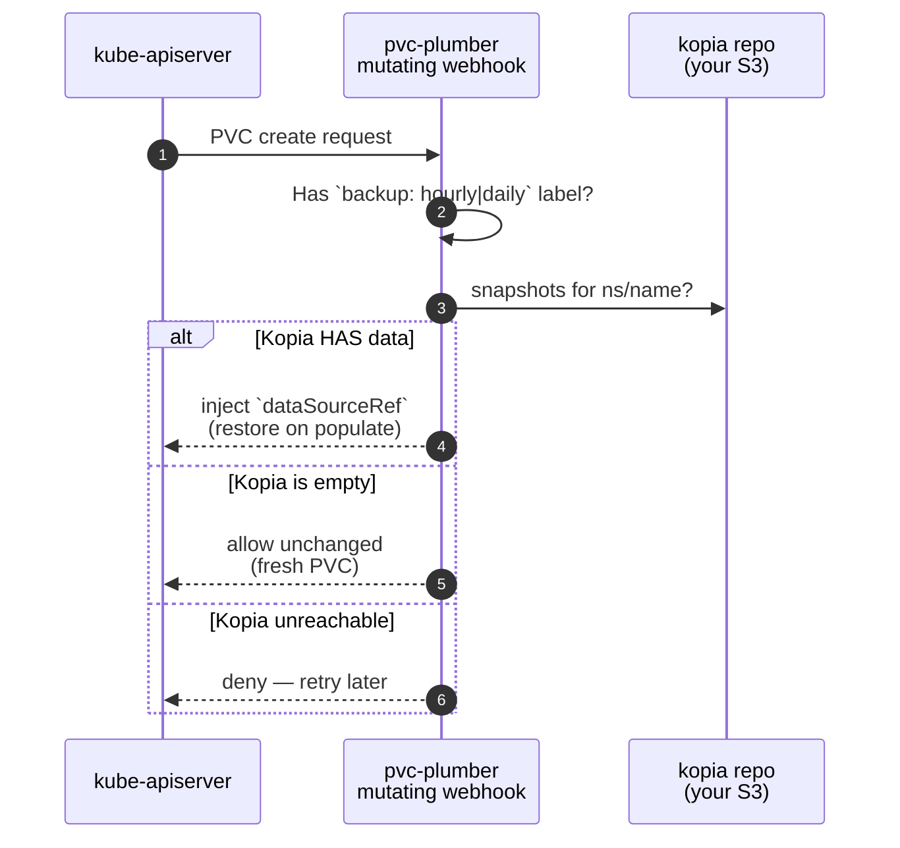
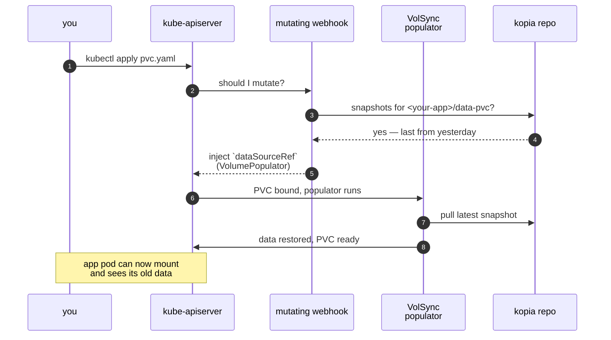
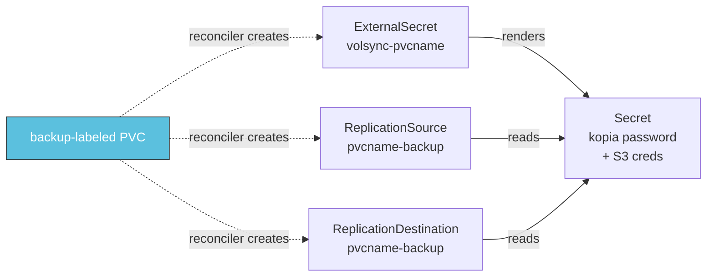
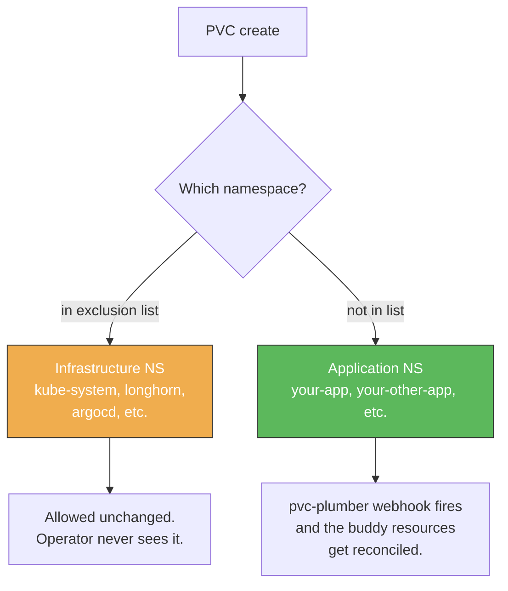
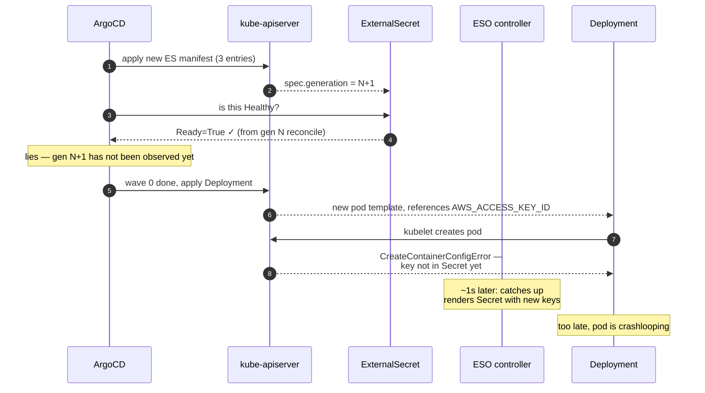

# pvc-plumber, explained for homelabbers

If you've got a Kubernetes cluster at home and you've ever wondered "OK but how do I actually back up my app data without writing a CronJob from scratch every time," this is the doc that explains how pvc-plumber gets you there. No prior controller-runtime knowledge needed.

## Status — 2026-05-08 baseline

This starter ships against **pvc-plumber v3.1.0**. The killer feature (restore-on-create from S3, end-to-end) has been proven on the source cluster as of 2026-05-08 — see the FAQ at the bottom for the test transcript.

---

## TL;DR

You add **one label** to a PVC. That's it.

```yaml
metadata:
  labels:
    backup: hourly      # or "daily"
```

The cluster takes care of:
- Snapshotting the volume on schedule
- Encrypting and uploading to your S3 storage
- **Restoring the data automatically the next time the PVC is recreated** — even after a full cluster rebuild. This is the killer feature.

If you don't want a PVC backed up (cache, scratch space, media on NAS), leave the label off OR explicitly opt out with `backup-exempt: "true"` plus a reason annotation so future-you knows why.

---

## The pieces in plain English

```
┌──────────────────────────────────────────────────────────┐
│ YOU (or ArgoCD, or a Helm chart)                         │
│                                                          │
│   apiVersion: v1                                         │
│   kind: PersistentVolumeClaim                            │
│   metadata:                                              │
│     name: my-app-data                                    │
│     namespace: my-app                                    │
│     labels:                                              │
│       backup: hourly        ← the entire interface       │
│   spec:                                                  │
│     storageClassName: longhorn                           │
│     ...                                                  │
└──────────────────────────────────────────────────────────┘
                       │
                       │ kubectl apply / argocd sync
                       ▼
┌──────────────────────────────────────────────────────────┐
│ kube-apiserver                                           │
│  "should I let this PVC be created?"                     │
│  "should I add anything to it?"                          │
└──────────────────────────────────────────────────────────┘
                       │
            ┌──────────┴──────────┐
            ▼                     ▼
   ┌─────────────────┐   ┌─────────────────┐
   │ pvc-plumber     │   │ pvc-plumber     │
   │ MUTATING webhook│   │ VALIDATING wh   │
   │  "is there      │   │  "is the intent │
   │   already kopia │   │   coherent?"    │
   │   data for this │   │                 │
   │   PVC?"         │   │                 │
   └─────────────────┘   └─────────────────┘
            │                     │
            └──────────┬──────────┘
                       ▼
                PVC is created
                       │
                       │ a moment later, asynchronously
                       ▼
┌──────────────────────────────────────────────────────────┐
│ pvc-plumber RECONCILER                                   │
│  "I see a new backup-labeled PVC. I need to set up the   │
│   ExternalSecret + ReplicationSource + ReplicationDest"  │
└──────────────────────────────────────────────────────────┘
                       │
                       ▼
              VolSync takes over
              and runs hourly backups
```

That's the whole architecture. Four pieces. Let's walk through each.

---

## What happens when a PVC is created

When you `kubectl apply -f pvc.yaml`, the kube-apiserver asks pvc-plumber two questions before letting the create through.

### Question 1: the mutating webhook (`mutate-pvc.pvc-plumber.io`)

> Hey pvc-plumber, **should I add anything to this PVC?**



The third branch is the safety contract: **if pvc-plumber can't decide, it refuses to let the PVC be created**. Better to make ArgoCD retry than to silently create an empty volume on top of a real backup.

### Question 2: the validating webhook (`validate-pvc.pvc-plumber.io`)

> Hey pvc-plumber, **is the intent coherent?**

This one's the audit-trail check. Mostly fires on `backup-exempt: "true"` PVCs to require a `storage.vanillax.dev/backup-exempt-reason` annotation from a fixed list (`cache`, `scratch`, `external-source`, `media-on-nas`, `database-native`, `test`). Silent exemption is exactly the foot-gun this exists to prevent.

If both webhooks pass, the PVC is created. The webhook chain ends there — kube-apiserver moves on.

---

## The killer feature: re-create after delete

This is the part you cannot do with a simple CronJob. When a PVC with backup data in kopia is **re-created** (because of a cluster rebuild, app re-deploy, or just `kubectl delete pvc && kubectl apply`), pvc-plumber tells Kubernetes to populate the volume from the existing kopia snapshot **before any pod can mount it**.



In plain English: you delete a PVC, you re-apply it, the data shows up like nothing happened. No manual restore step. No "oh wait I forgot to restore the database" the morning after a cluster rebuild.

---

## What happens after the PVC is created (the reconciler)

The webhooks run synchronously — they answer the apiserver's question and they're done. Everything else happens asynchronously through the **reconciler**, which is a separate controller loop watching PVCs.

When the reconciler sees a backup-labeled PVC become Bound, it ensures three buddy resources exist alongside it:



- **ExternalSecret `volsync-<pvcname>`** — pulls the kopia password and S3 credentials from your secret-store backend, materializes them as a Kubernetes Secret. The External Secrets Operator (ESO) does the actual fetch.
- **ReplicationSource `<pvcname>-backup`** — VolSync's "back this up on schedule" CR. Has a cron, has the kopia config, points at the source PVC.
- **ReplicationDestination `<pvcname>-backup`** — VolSync's "ready to populate from kopia if asked" CR. The mutating webhook above injects a `dataSourceRef` that points at this on restore.

Once these exist, **VolSync's controllers own the lifecycle.** Every hour (or day), VolSync spawns a Job that snapshots the PVC, runs kopia, uploads chunks to your S3.

pvc-plumber's reconciler also does **cleanup** — when a backup-labeled PVC is deleted (or its label is removed, or it moves into a system namespace), the three buddy resources get reaped.

---

## The supporting cast

| Component | What it does | Where it lives |
|---|---|---|
| **pvc-plumber** | Decides whether to inject `dataSourceRef`. Creates ES/RS/RD per backup-labeled PVC. | `volsync-system` namespace |
| **VolSync** | Runs the actual backup Jobs on schedule. Handles populate-from-kopia on restore. | `volsync-system` namespace, fork: `ghcr.io/perfectra1n/volsync` |
| **kopia** | The backup format itself. Content-addressed, deduplicated, encrypted client-side. | Inside the VolSync mover Job's container |
| **Your S3** | Where the kopia repo blobs live. Could be in-cluster MinIO, RustFS, AWS S3, Backblaze B2, MinIO on TrueNAS — anything S3-API-compatible. | `__REPLACE_ME_S3_ENDPOINT__:__REPLACE_ME_S3_PORT__`, bucket `volsync-kopia` |
| **ESO + secret-store** | Pulls the kopia password + S3 creds from your backend (sealed-secrets default in this starter; swap to 1Password Connect / Vault / AWS SM / etc). | `external-secrets`, `sealed-secrets` namespaces |
| **cert-manager** | Issues TLS certs for pvc-plumber's webhooks (port 9443). | `cert-manager` namespace |
| **Longhorn** | The storage class your PVCs actually live on. CSI snapshots are how VolSync grabs a consistent point-in-time copy without freezing the app. | `longhorn-system` namespace |

---

## How a fresh cluster boots (sync waves)

When you bring up the cluster from nothing, Kubernetes itself doesn't know that pvc-plumber needs to be up before any backup-labeled PVC. ArgoCD orchestrates the order with **sync waves** — a number annotation on each resource. ArgoCD applies wave 0 first, waits for everything to be Healthy, applies wave 1, and so on.

```
wave 0 ┃ Cilium (CNI)            ← network must work first
       ┃ ArgoCD itself (bootstrap)
       ┃ External Secrets Operator
       ┃ sealed-secrets (or your secret backend)
       ┃ AppProjects

wave 1 ┃ Longhorn                 ← storage class for PVCs
       ┃ Volume Snapshot Controller
       ┃ VolSync                  ← backup machinery
       ┃ pvc-plumber operator     ← from here on, backup-labeled
       ┃ pvc-plumber RBAC + ES + Cert    PVCs in app namespaces work
       ┃ cert-manager

wave 2 ┃ pvc-plumber webhooks     ← admission gating activates here

wave 3 ┃ CNPG operator + Barman plugin   ← database backup plumbing

wave 4 ┃ Infrastructure AppSet + Database AppSet (postgres clusters)

wave 5 ┃ Monitoring AppSet (kube-prometheus-stack, loki)

wave 6 ┃ Apps AppSet — your stateless + stateful demo apps
```

If pvc-plumber wasn't there in wave 1, every backup-labeled PVC in wave 4+ would be **denied at admission** because the webhook is `failurePolicy: Fail`. That's intentional: it's the same "if I can't tell whether a backup exists, I refuse" safety contract from earlier, applied at the cluster scale.

---

## Why the bootstrap doesn't deadlock itself

Here's a riddle: pvc-plumber's webhook says "deny PVC creation if I'm down." But pvc-plumber itself runs in `volsync-system`, which has its own machinery and might one day need its own ExternalSecret. If pvc-plumber's webhook fired on its own PVCs, the cluster would deadlock during bootstrap (operator can't create its own PVCs because the webhook isn't running yet because the operator hasn't started).

The fix is **infrastructure namespace exclusion**. Both the webhook's `namespaceSelector` and the operator's `SYSTEM_NAMESPACES` env var carry the same list:

```
kube-system
volsync-system
kyverno
argocd
longhorn-system
snapshot-controller
cert-manager
sealed-secrets
external-secrets
```

PVCs created in any of those namespaces **bypass pvc-plumber entirely**. The webhook never fires for them. The reconciler skips them. The bootstrap can come up cleanly because the bootstrap itself is invisible to pvc-plumber.



The list has to stay in sync between `infrastructure/controllers/pvc-plumber/webhooks.yaml` (the namespaceSelector) AND `infrastructure/controllers/pvc-plumber/deployment.yaml` (the operator's `SYSTEM_NAMESPACES` env). Drift between the two is the actual cluster-safety bug. The 2026-04-08 incident on the source cluster (Kyverno crash, full cluster wedge) was triggered by a missing namespace in this list — the `kyverno` entry stays in this starter as a defensive forward-compat marker even though Kyverno isn't installed.

---

## The ArgoCD ↔ ESO race (the bug fixed in v3.1.0)

OK now the war story, because it's pedagogically useful. During the v3.0.0 cutover (2026-05-08 on the source cluster), the operator hit a race condition that took the pod down and required manual intervention to unstick. The fix is now in tree as v3.1.0 and is what this starter ships.

### What went wrong

The v3.0.0 commit changed the `pvc-plumber-kopia` ExternalSecret from one entry (`KOPIA_PASSWORD`) to three (added `AWS_ACCESS_KEY_ID` + `AWS_SECRET_ACCESS_KEY`). The Deployment in the same commit referenced those new keys via `secretKeyRef` env vars.

ArgoCD's sync waves had ExternalSecret in wave 0 and the Deployment in wave 1. So in theory: ES first, wait for it to be Healthy, then Deployment.

In practice:



ArgoCD's default health check for ExternalSecret only looks at `status.conditions[Ready].status`. ESO leaves that field set to `True` from the previous generation's reconcile until it gets around to processing the new generation. So ArgoCD declared the ES Healthy on the **stale** Ready, moved to wave 1, and the Deployment rolled into a Secret that hadn't caught up yet.

### Why ESO doesn't expose `observedGeneration`

ESO's `ExternalSecret` CRD status struct has `RefreshTime`, `SyncedResourceVersion`, `Conditions`, `Binding` — but **no `observedGeneration` field**. There's an upstream issue ([argo-cd#22707](https://github.com/argoproj/argo-cd/issues/22707)) acknowledging this gap. No PR yet.

But ESO DOES publish `status.syncedResourceVersion` in the format `"<generation>-<hash>"` — and that's exactly what we need.

### The fix — operator-side, shipped as v3.1.0

A cluster-wide Lua health check on ExternalSecret was considered (it's what [argo-cd#22707](https://github.com/argoproj/argo-cd/issues/22707) proposes upstream) and rejected because it's the kind of complexity the cluster's already cleaned up once. See [`.claude/rules/no-lua-in-argocd-cm.md`](../.claude/rules/no-lua-in-argocd-cm.md) for the four-bar test on when to reach for Lua. The trade-off here was: keep ArgoCD configuration simple, fix the race in the application layer, accept that other ExternalSecrets in the repo stay exposed during future schema changes (mitigation pattern documented further down).

The fix lives in the application layer and shipped as **pvc-plumber v3.1.0**:

- Operator pod no longer reads `KOPIA_PASSWORD` / `AWS_ACCESS_KEY_ID` / `AWS_SECRET_ACCESS_KEY` via `secretKeyRef` env vars. Those env vars are gone from the Deployment.
- Instead, the same `pvc-plumber-kopia` Secret is **mounted as a directory** at `/var/secret/pvc-plumber-kopia`. Each Secret key becomes a file (kopia_password, aws_access_key_id, aws_secret_access_key).
- The kopia client reads creds from disk on **every kopia subprocess invocation**, not at pod startup. If a file is missing or empty (ESO mid-render), Connect returns `ErrCredentialsNotReady` and is retried with exponential backoff up to 60s.
- Pod becomes `Running` immediately. **`/readyz` is upgraded** to actually validate the kopia connection (5s cap) — pod is `Ready: false` until kopia is genuinely usable, even though it's `Running`. Kubelet doesn't route admission webhook traffic to a not-Ready pod, so a half-initialized operator can't deny PVC creates.

Behavior change worth knowing: pods will flap Ready/NotReady during transient S3 outages. That's the intended signal — `failurePolicy: Fail` webhooks stop receiving traffic from a pod that can't reach kopia.

This narrows the blast radius — only pvc-plumber benefits — but it's the architecturally cleaner answer:

- No new ArgoCD config to babysit
- Fix is portable to any cluster running pvc-plumber, not bound to one cluster's specific argocd-cm
- Survives a future ArgoCD upstream fix (#22707) without needing to delete config to avoid duplication

### Pair fix already in tree: tighter refreshInterval

Lowered the `pvc-plumber-kopia` ExternalSecret `refreshInterval` from `1h` to `1m`. Doesn't affect the spec-change case (ESO observes those via watch, not refresh), but bounds the worst case if ESO ever has to catch up after a controller restart.

### What about other ExternalSecrets in the repo?

Honest answer: they keep the latent race. ES schema changes are rare in steady-state — most ESes are write-once-and-forget. When the race does bite again (some future schema change, on some other operator), the documented unstick pattern is:

```bash
# 1. apply the new ES manifest directly, bypassing ArgoCD's stuck wave
kubectl apply --server-side --force-conflicts -f <es-manifest>

# 2. force ESO to re-render the Secret immediately
kubectl annotate externalsecret <name> -n <ns> force-sync=$(date +%s) --overwrite

# 3. let ArgoCD reconcile to match
kubectl annotate -n argocd application <app> argocd.argoproj.io/refresh=hard --overwrite
```

---

## FAQ for homelabbers

### How do I add a new app to backups?

Slap `backup: hourly` (or `daily`) on the PVC label. Push. Done. The reconciler will create the ExternalSecret + ReplicationSource + ReplicationDestination on its own. See `apps/stateful-demo/pvc.yaml` in this starter for the canonical example.

### How do I restore?

Delete the PVC. Re-apply the manifest. Data restores automatically (mutating webhook detects existing kopia snapshots and injects `dataSourceRef`). No manual `kopia restore` command needed for the common case.

### What if I want a PVC that's NOT backed up?

Either:
- Don't add the `backup` label (the simplest opt-out — the operator doesn't see it at all)
- Add `backup-exempt: "true"` AND the annotation `storage.vanillax.dev/backup-exempt-reason: cache` (or `scratch`, `external-source`, `media-on-nas`, `database-native`, `test`). This makes the intent explicit and audit-trail-visible.

### What if pvc-plumber is down when I try to create a PVC?

The webhook is `failurePolicy: Fail`. New backup-labeled PVCs will be denied at admission. ArgoCD will retry on backoff. **This is intentional** — the alternative ("create empty over a real backup") is silent data loss, the worst-possible failure mode. PVCs in infrastructure namespaces (kube-system, longhorn-system, argocd, etc.) bypass the webhook entirely and keep working even if pvc-plumber is down — that's what keeps the cluster bootable when it's down.

### What about CNPG databases (Postgres, etc.)?

Different system. CNPG uses Barman Cloud (built into CloudNativePG) to back up Postgres directly to S3 via the `cnpg-barman-plugin` and per-cluster `ObjectStore` resources. **Don't add the `backup` label to CNPG PVCs** — they're already protected via Barman, and labeling them would create duplicate (and broken) backup machinery. See [docs/cnpg-explained.md](cnpg-explained.md).

### How do I see what kopia has?

```bash
# the operator pod has the kopia binary; ad-hoc queries work like:
kubectl exec -n volsync-system deploy/pvc-plumber -- \
  kopia snapshot list --all 2>/dev/null | grep -i <your-app>
```

Or browse the bucket directly via your S3 console (if it has one).

### Where do I look if a backup is broken?

1. `kubectl get rs -A` — check `LAST SYNC` column. Recent (today) = good. Stale = suspect.
2. `kubectl logs -n volsync-system deploy/pvc-plumber` — operator decisions live here.
3. `kubectl logs -n volsync-system deploy/volsync` — VolSync's mover Job orchestration lives here.
4. `kubectl get jobs -A -l app.kubernetes.io/created-by=volsync` — active mover Jobs. If a backup is in progress, you'll see one.
5. The starter's `monitoring/kube-prometheus-stack` has alert rules for `PVCPlumberDown`, `VolSyncControllerDown`, `VolSyncMissedScheduledBackup` — those fire to your Alertmanager.

### Has restore-on-create actually been proven end-to-end?

Yes — on 2026-05-08 against a real app on the source cluster (the bookmark manager Karakeep). The drill: `kubectl delete pvc karakeep-data`, re-apply the manifest, watched the mutating webhook inject `dataSourceRef`, watched VolSync's populator pull from kopia S3, watched the new PV bind with restored data. 231 files, byte-for-byte identical to pre-delete state. This is what the starter is teaching you to set up.

---

## Related docs

- [docs/cnpg-explained.md](cnpg-explained.md) — the OTHER backup system (database-native, NEVER use pvc-plumber on CNPG PVCs)
- [docs/architecture.md](architecture.md) — sync waves and ApplicationSet discovery (whole cluster)
- [docs/secret-management.md](secret-management.md) — sealed-secrets default, swapping to other ESO backends
